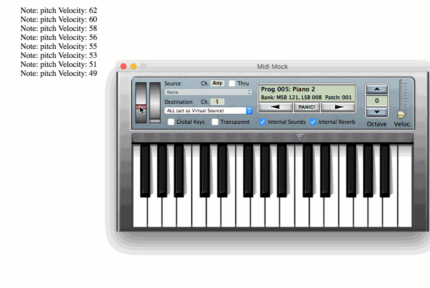

# Midi-Synth (WIP)

This project is a sandbox for experimenting HTML5 WebAudio API and MIDI API

## Getting started

### Install packages

```
$ yarn install
```

### Run

```
$ yarn start
```

### Play...

